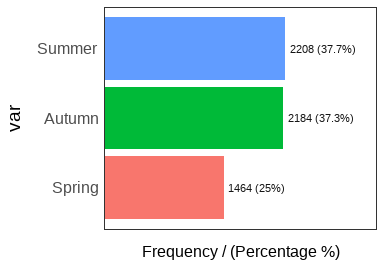
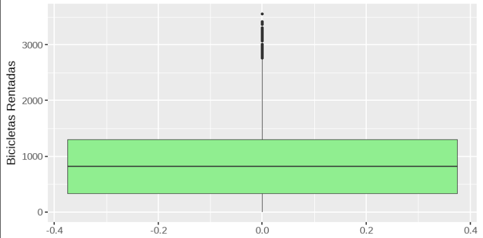
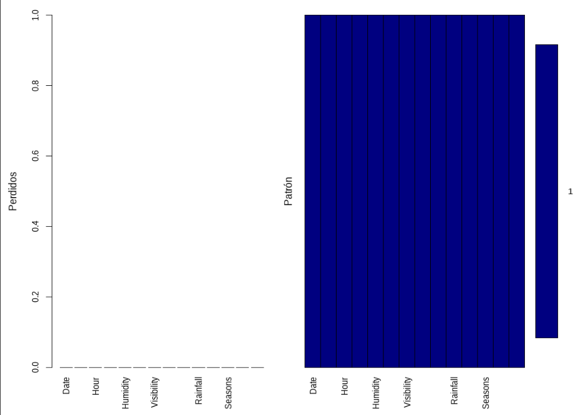

```{r,include=FALSE}
knitr::opts_chunk$set(echo = FALSE, message=FALSE, warning=FALSE, 
dev="cairo_pdf", fig.width=7, fig.height=3.5,fig.pos = 'H')
```
\newpage


\section{Tabla de contenidos}
\section{Índice de figuras y tablas}

\newpage


\section{Introducción}

El preprocesamiento de datos y la administración de los mismos nos permiten la recolección de datos de distintas fuentes, el tratamiento de filas y cabeceras (headers o columnas). Con esto podemos hacer una limpieza adecuada, eliminar errores, corregir inconsistencias y aumentar la calidad de la minería de datos, una correcta gestión de datos también nos sirve para acceder a diferentes datos de una forma más fácil, así obtenemos información estadística y comparativa que permite una correcta toma de decisiones y abarcar de mejor manera  los distintos problemas empresariales.

Utilizar referencias para explicar la importancia del análisis exploratorio de datos. (Ejemplo para citar las referencias [@provost2013data])

Descripción del conjunto de datos (número de observaciones, número de variables, cuáles son las variables involucradas en el estudio, tipos de variables)

Editar este código, debe incluir las librerías que necesita, y cargar los datos:

```{r,echo=F}
library(tidyverse)
library(visdat)#tipos de variables
library(dlookr)#resumen medidas estadísticas
library(funModeling)
library(flextable) 
library(inspectdf) 
library(qqplotr) 
library(ggpmisc)
library(PerformanceAnalytics)
library(corrplot)
library(VIM) #datos faltantes
library(mice)
library(knitr)
```

\newpage
\section{Desarrollo}
  
\subsection{Resumen de medidas estadísticas}
Resumen de medidas estadísticas de rentBike (en una tabla), e interpretación.


```{r tab1, echo=F,out.width = '100%'}
datos <- read.csv("rentBike_data.csv",sep = ",",header = TRUE)
tab1 <- diagnose_numeric(datos)
kable(tab1,caption = "\\label{tab:tab1}Resumen de medidas estadísticas.",digits = 2) 
```
\newpage
\subsection{Análisis de la variable Seasons}
Análisis de una variable tipo entera o categórica, representación gráfica de la frecuencia de cada categoría

```{r fig1,echo=F,fig.align = "center",out.width = '100%',fig.cap="\\label{fig:fig1}Histograma de Seasons."}
#{r fig1, echo=FALSE, fig.cap="Título de la figura", out.width = '100%'}

```

\newpage
\subsection{Análisis de la variable Bicicletas Rentadas Rented Bike Count}
Análisis de una variable tipo numérica (tabla de frecuencias, histograma de frecuencias y curva de densidad) y análisis de normalidad (Q-Q plot y prueba de normalidad)


```{r tab2, echo=F,out.width = '100%'}
datos <- read.csv("rentBike_data.csv",sep = ",",header = TRUE)
n<-length(na.omit(datos$Rented_Bike_Count))
#(max(datos$Rented_Bike_Count,na.rm = T)-min(datos$Rented_Bike_Count,
 #                                 na.rm = T))/(1+3.322*log10(n))
datos$Rented_Bike_Count = cut(datos$Rented_Bike_Count, breaks=seq(0,180,20))


tb.freq<-function(x){
  f_i<-as.vector(table(x)) #freq absoluta
  F_i<-cumsum(f_i) #freq acumulada
  h_i<-f_i/length(x) #freq relativa
  H_i<-F_i/length(x) #freq relativa acumulada
  tf<-cbind(f_i,F_i,h_i,H_i)
  row.names(tf)<-names(table(x))
  tf
}
#tb.freq(datos$Rented_Bike_Count.cut)
tab2 <- diagnose_category(datos[!is.na(datos$Rented_Bike_Count),],Rented_Bike_Count)
kable(tab2,caption = "\\label{tab:tab2}Tabla de frecuencias de Bicicletas Rentadas Rented Bike Count.",digits = 2) 
```


```{r fig3,echo=F,fig.align = "center",out.width = '100%',fig.cap="\\label{fig:fig3}Histograma con curva de densidad de Bicicletas Rentadas Rented Bike Count."}
#{r fig1, echo=FALSE, fig.cap="Título de la figura", out.width = '100%'}
knitr::include_graphics("frec_density.png")
```
```{r fig4,echo=F,fig.align = "center",out.width = '100%',fig.cap="\\label{fig:fig4}Q-Q plot de Bicicletas Rentadas Rented Bike Count."}
#{r fig1, echo=FALSE, fig.cap="Título de la figura", out.width = '100%'}
knitr::include_graphics("qq.png")
```

```{r, echo=F,out.width = '100%'}
#ks.test(datos$Rented_Bike_Count,"pnorm",mean=mean(datos$Rented_Bike_Count,
#                                                  na.rm = #T),sd=sd(datos$Rented_Bike_Count,na.rm=T))
```


\newpage
\subsection{Valores Atípicos}
 Identificación de valores atípicos (boxplot variable numérica (2.3), boxplot relación variable numérica (2.3) con variable entera o categórica (2.2)

```{r fig5,echo=F,fig.align = "center",out.width = '100%',fig.cap="\\label{fig:fig5}Datos Atípicos de Bicicletas Rentadas Rented Bike Count. "}
#{r fig1, echo=FALSE, fig.cap="Título de la figura", out.width = '100%'}

```
```{r fig6,echo=F,fig.align = "center",out.width = '100%',fig.cap="\\label{fig:fig6}Boxplot de la variable Seasons. "}
#{r fig1, echo=FALSE, fig.cap="Título de la figura", out.width = '100%'}
knitr::include_graphics("boxplot_seasons.png")
```
\newpage
\subsection{Datos Faltantes}
Determinar proporción de datos faltantes
```{r fig7,echo=F,fig.align = "center",out.width = '100%',fig.cap="\\label{fig:fig7}Gráfico de Datos faltantes."}
#{r fig1, echo=FALSE, fig.cap="Título de la figura", out.width = '100%'}

```
\newpage
\subsection{Análisis de Correlación}
Análisis de correlación, representación de matriz de correlación.

```{r fig8,echo=F,fig.align = "center",out.width = '100%',fig.cap="\\label{fig:fig8}Matriz de Correlación."}
#{r fig1, echo=FALSE, fig.cap="Título de la figura", out.width = '100%'}
knitr::include_graphics("corr.png")
```

\section{Conclusiones}

Resuma las principales conclusiones de cada análisis realizado como parte del desarrollo.

\section{Referencias Bibliográficas}
Referencias Bibliográficas {#references .unnumbered}

\section{Anexos}
\subsection{fig}

Ejemplo para hacer la tabla (Ver Tabla \ref{tab:tab1})  

setwd("D:\\UNAB\\MINERIA DE DATOS\\AE1")
datos <- read.csv("rentBike_data.csv",sep = ",",header = TRUE)
diagnose_numeric(datos) %>% flextable()

funModeling::freq(datos$Seasons)

==========
