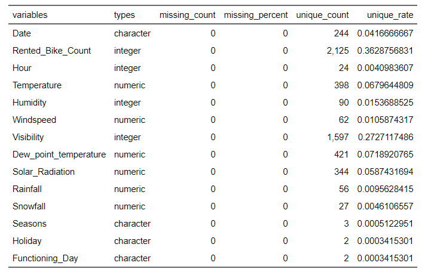

```{r setup, include=FALSE}
#install.packages("tinytex")
# | 
 # ```{=latex}
 # \textcolor{white}{\textbf{AE-1}}
  #```
library(tidyverse)
library(visdat)#tipos de variables
library(dlookr)#resumen medidas estadísticas
library(funModeling)
library(flextable) 
library(inspectdf) 
library(qqplotr) 
library(ggpmisc)
library(PerformanceAnalytics)
library(corrplot)
library(VIM) #datos faltantes
library(mice)
knitr::opts_chunk$set(message=FALSE, warning=FALSE,
tidy.opts=list(width.cutoff=20),ft.tabcolsep=0, ft.latex.float = "none")
```

## Introducción

- La Importancia del Preprocesamiento.  

- Administración de Datos.  

- Análisis Exploratorio de Datos.  

{width="200px"}
```{r echo=FALSE, include=FALSE}
#
```

## Base de Datos

Renta de Bicicletas (rentBike)

- 5856 observaciones.

- 14 variables:

::: columns

:::: column
\begingroup

\fontfamily{phv}\fontsize{9}{16}\selectfont

-Date 
-Rented_Bike_Count    
-Hour                 
-Temperature          
-Humidity             
-Windspeed            
-Visibility  
-Dew_point_temperature 

\endgroup
::::

:::: column
\begingroup

\fontfamily{phv}\fontsize{9}{16}\selectfont
 
-Solar_Radiation      
-Rainfall             
-Snowfall             
-Seasons              
-Holiday              
-Functioning_Day

\endgroup
::::

:::


## Tipos de Variables
Variables: Cualitativas, Cuantitativas (Enteros y Numéricas)

{width="400px"}
\begingroup
\fontfamily{phv}\fontsize{6}{16}\selectfont
```{r echo=FALSE, include=FALSE}
#
#library(flextable)
#knitr::opts_chunk$set(echo = FALSE, ft_max_row = 6, tab.topcaption=FALSE, ft.align="left")
#set_flextable_defaults(font.size = 11, padding = 3)
#visdat::vis_dat(datos,sort_type = FALSE) 
#diagnose(datos) %>% flextable()
```
\endgroup

## Gráfico de Barras de la variable
\begingroup
\fontfamily{phv}\fontsize{9}{16}\selectfont
Representación gráfica de la frecuencia en Seasons.    
Obs: No existe la Categoría "Winter"  
\endgroup
{width="300px"}

```{r echo=FALSE, include=FALSE}
setwd("D:\\UNAB\\MINERIA DE DATOS\\AE1")
datos <- read.csv("rentBike_data.csv")
#install.packages("funModeling")
#library(funModeling)
#funModeling::freq(datos$Seasons)
```
## Resumen de medidas estadísticas de todas las variables, en una tabla.
- Mínimos, Máximos, Medias, Cuartiles, Datos Atípicos...
{width="350px"}
```{r echo=FALSE, fig.height = 2.3, fig.width = 3.5,fig.pos='h',fig.align='center'}
#

```


## Análisis de variable numérica con histograma de frecuencias y curva de densidad.

{width="350px"}
```{r, echo=F}
#n<-length(na.omit(datos$Rented_Bike_Count))
#ggplot(data=datos[!is.na(datos$Rented_Bike_Count),], aes(x=Rented_Bike_Count)) + 
 # geom_histogram(aes(y =..density..),
 #                breaks=seq(0,3600,82), 
#                 col="black", 
 #                fill="green", 
#                 alpha = .2) +
#  stat_function(fun = dnorm, args = list(mean = #mean(datos$Rented_Bike_Count,na.rm=T), 
                              #           sd = #sd(datos$Rented_Bike_Count,na.rm=T)),color=2,size=1)+
  #labs(x = "Rented_Bike_Count", y = "Densidad")+
  #theme(text = element_text(size=14))+
 # theme_grey(base_size = 16)

```


## Análisis de normalidad de variable numérica con gráfico Q-Q

{width="350px"}


## Prueba de Normalidad
{width="400px"}  
\begingroup
\fontfamily{phv}\fontsize{9}{16}\selectfont
Test de kolmogorov-smirnov:  
  
data:  datos$Rented_Bike_Count  
D = 0.092264   
p-value < 2.2e-16  
  
alternative hypothesis:  
two-sided  
\endgroup
 


```{r, echo=F}
#(ks.test o shapiro.test)
#install.packages("qqplotr")
#library(qqplotr)

#ggplot(data = datos[!is.na(datos$Rented_Bike_Count),], mapping = aes(sample = Rented_Bike_Count)) +
 # stat_qq_line()+
 # stat_qq_band()+
#  stat_qq_point()+
 # labs(x = "Q-Normal", y = "Q-Rented_Bike_Count (ppb)")+
 # theme(text = element_text(size=14))+
  #theme_grey(base_size = 16)
#install.packages("flextable")
#library(flextable)
#ks.test(datos$Rented_Bike_Count,"pnorm",mean=mean(datos$Rented_Bike_Count,na.rm = T),sd=sd(datos$Rented_Bike_Count,na.rm=T))
#shapiro.test(datos$Rented_Bike_Count)
#normality(datos) %>% flextable()
```

##  Identificación de datos atípicos de la variable numérica con uso de boxplot.
```{r, echo=F}
boxp_mc<-ggplot(datos[!is.na(datos$Rented_Bike_Count),], aes(y=Rented_Bike_Count)) + 
  geom_boxplot(fill="lightgreen",varwidth = T)+
  labs(x = "", y = "Bicicletas Rentadas")+
  theme(text = element_text(size=14))+
  theme_grey(base_size = 16)
boxp_mc
```

##  Uso de boxplot para relacionar la variable numérica con la variable entera o categórica del análisis anterior.
```{r, echo=F}
#Con variable categorica

boxp_mc<-ggplot(datos[!is.na(datos$Rented_Bike_Count),], aes(y=Rented_Bike_Count, x=factor(Seasons))) + 
  geom_boxplot(fill="lightgreen",varwidth = T)+
  labs(x = "Estaciones", y = "Bicicletas Rentadas")+
  theme(text = element_text(size=14))+
  theme_grey(base_size = 16)

boxp_mc
```

## Gráfico que visualice la proporción de datos faltantes.
```{r, echo=F}
#sum(is.na(datos$Rented_Bike_Count))
#which(is.na(datos$Rented_Bike_Count))
#datos$Rented_Bike_Count[4]

#install.packages("VIM")
library(VIM)
VIM::aggr(datos, col=c('navyblue','red'),
          numbers=TRUE, sortVars=TRUE,
          labels=names(datos), cex.axis=1,
          gap=3, ylab=c("Perdidos","Patrón"))
```

## Representación gráfica de la matriz de correlación.
Matriz de correlación
```{r, echo=F}
#sum(is.na(datos$Rented_Bike_Count))
#which(is.na(datos$Rented_Bike_Count))
#datos$Rented_Bike_Count[4]


cor_matrix<-cor(datos[,2:10],method = "spearman",use = "complete.obs")

#install.packages("corrplot")
library(corrplot)
#png("cor_plot.png",width = 4, height =4,units = "in",pointsize = 16,res = 300)
corrplot(cor_matrix, method="ellipse",type = "upper")
```

## Conclusiones


- Alto nivel de correlación entre la variables.
- Ningún dato faltante.
- La variable Rented bike count no está normalizada y es asimétrica positiva.
- Datos atípicos.
- Resultados del análisis en la venta de Bicicletas.


