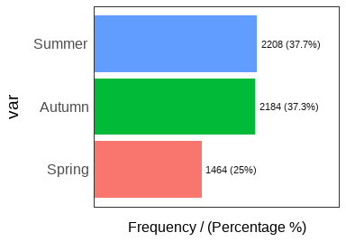
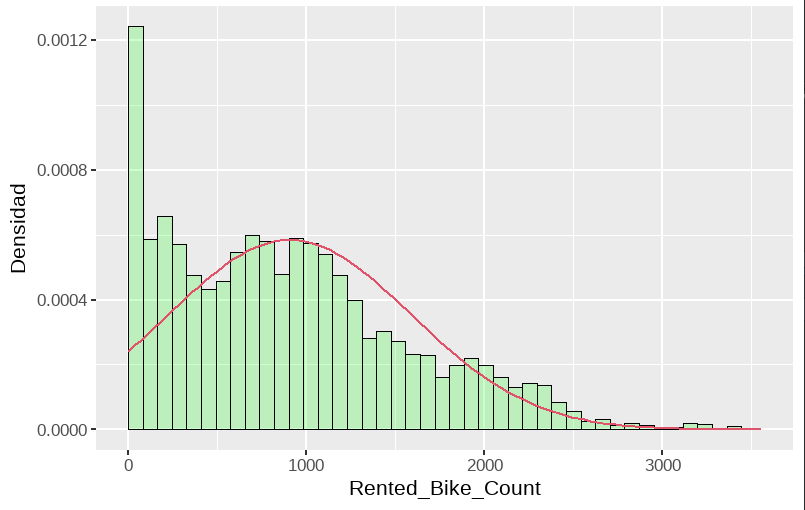
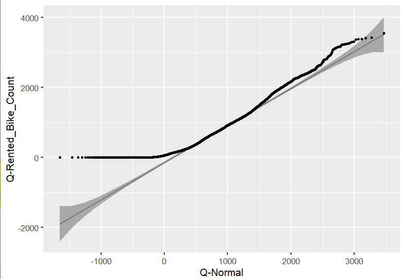
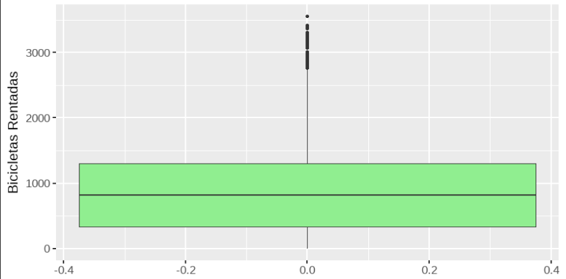
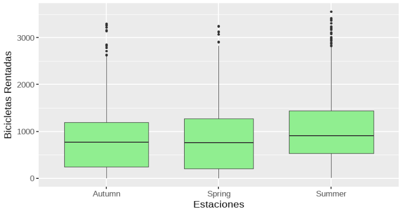
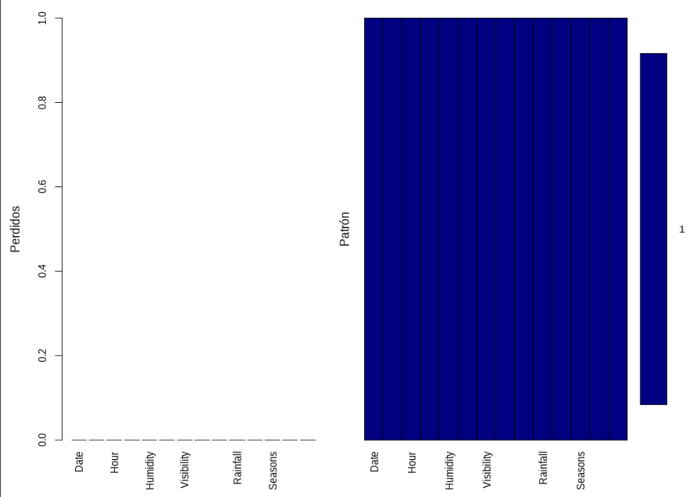
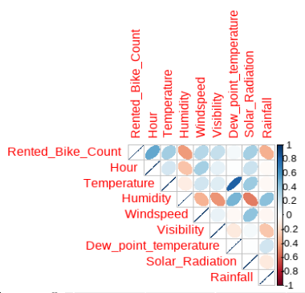

```{r,include=FALSE}
knitr::opts_chunk$set(echo = FALSE, message=FALSE, warning=FALSE, 
dev="cairo_pdf", fig.width=7, fig.height=3.5,fig.pos = 'H')
```


\newpage


\section{Introducción}

El preprocesamiento de datos y la administración de los mismos nos permiten la recolección de datos de distintas fuentes, el tratamiento de filas y cabeceras (headers o columnas). Con esto podemos hacer una limpieza adecuada, eliminar errores, corregir inconsistencias y aumentar la calidad de la minería de datos, una correcta gestión de datos también nos sirve para acceder a diferentes datos de una forma más fácil, así obtenemos información estadística y comparativa que permite una correcta toma de decisiones y abarcar de mejor manera los distintos problemas empresariales.

En este caso nuestra base de datos es de una renta de bicicletas que cuenta con 5856 observaciones clasificadas en las siguientes 14 variables con su tipo de variable correspondiente:

1.	Fecha (Categórica)
2.	Recuento de bicicletas alquiladas (Numérica)
3.	Hora (Numérica)
4.	Temperatura (Numérica)
5.	Humedad (Numérica)
6.	Velocidad del viento (Numérica)
7.	Visibilidad (Numérica)
8.	Temperatura de punto de rocío (Numérica)
9.	Radiación solar (Numérica)
10.	Lluvia (Numérica)
11.	Nevada (Numérica)
12.	Estaciones (Categórica)
13.	Vacaciones (Categórica)
14.	Día de funcionamiento (Categórica)

Nuestro objetivo es analizar esta base de datos, variables categóricas y numéricas para ver su distribución, determinar si hay datos atípicos, datos faltantes y ver como se relacionan las distintas variables entre sí.

```{r,echo=F}
library(tidyverse)
library(visdat)#tipos de variables
library(dlookr)#resumen medidas estadísticas
library(funModeling)
library(flextable) 
library(inspectdf) 
library(qqplotr) 
library(ggpmisc)
library(PerformanceAnalytics)
library(corrplot)
library(VIM) #datos faltantes
library(mice)
library(knitr)
```

\newpage
\section{Desarrollo}
  
\subsection{Resumen de medidas estadísticas}
 \ref{tab:tab1}
\newpage
```{r tab1, echo=F,out.width = '100%'}
datos <- read.csv("rentBike_data.csv",sep = ",",header = TRUE)
tab1 <- diagnose_numeric(datos)
kable(tab1,caption = "\\label{tab:tab1}Resumen de medidas estadísticas.",digits = 2) 
```

\subsection{Análisis de la variable Seasons}


En la figura \ref{fig:fig1} solo tiene 3 estaciones, podemos asumir que no existe recolección de datos durante el invierno debido a las características climáticas, presentando un clima demasiado frió y con posible nieve que son razones por las cuales los clientes no quieran rentan bicicletas y que la empresa no opere durante ese tiempo por las nulas ganancias.

```{r fig1,echo=F,fig.align = "center",out.width = '100%',fig.cap="\\label{fig:fig1}Histograma de Seasons."}
#{r fig1, echo=FALSE, fig.cap="Título de la figura", out.width = '100%'}

```


\subsection{Análisis de la variable Bicicletas Rentadas Rented Bike Count}


\newpage
```{r tab2, echo=F,out.width = '100%'}
datos <- read.csv("rentBike_data.csv",sep = ",",header = TRUE)
n<-length(na.omit(datos$Rented_Bike_Count))
#(max(datos$Rented_Bike_Count,na.rm = T)-min(datos$Rented_Bike_Count,
 #                                 na.rm = T))/(1+3.322*log10(n))
datos$Rented_Bike_Count = cut(datos$Rented_Bike_Count, breaks=seq(0,180,20))


tb.freq<-function(x){
  f_i<-as.vector(table(x)) #freq absoluta
  F_i<-cumsum(f_i) #freq acumulada
  h_i<-f_i/length(x) #freq relativa
  H_i<-F_i/length(x) #freq relativa acumulada
  tf<-cbind(f_i,F_i,h_i,H_i)
  row.names(tf)<-names(table(x))
  tf
}
#tb.freq(datos$Rented_Bike_Count.cut)
tab2 <- diagnose_category(datos[!is.na(datos$Rented_Bike_Count),],Rented_Bike_Count)
kable(tab2,caption = "\\label{tab:tab2}Tabla de frecuencias de Bicicletas Rentadas Rented Bike Count.",digits = 2) 
```

El gráfico del histograma con curva de densidad correspondiente a la figura \ref{fig:fig3} podemos analizar que la mayoría de las frecuencias está concentrada en los primeros intervalos, es decir la variable presenta una asimetría positiva y una variación heterogénea, presentando una tendencia a una mayor densidad mientras se esté más cerca del cero mientras menos bicicletas hayan sido alquiladas
```{r fig3,echo=F,fig.align = "center",out.width = '100%',fig.cap="\\label{fig:fig3}Histograma con curva de densidad de Bicicletas Rentadas Rented Bike Count."}
#{r fig1, echo=FALSE, fig.cap="Título de la figura", out.width = '100%'}

```
\newpage
Según el gráfico Q-Q obtenido correspondiente a la figura \ref{fig:fig4} se puede concluir que los datos en su mayoría mantienen una distribución asimétrica positiva. 
```{r fig4,echo=F,fig.align = "center",out.width = '100%',fig.cap="\\label{fig:fig4}Q-Q plot de Bicicletas Rentadas Rented Bike Count."}
#{r fig1, echo=FALSE, fig.cap="Título de la figura", out.width = '100%'}

```

Segun el test de kolmogorov-smirnov de la variable bicicletas rentadas el valor de probabilidad es menor a  2.2e-16. Por ende rechazamos la hipótesis nula al ser nuestro valor no mayor a 0.05, es decir la distribución no es normal.  
```{r}
datos <- read.csv("rentBike_data.csv",sep = ",",header = TRUE)
ks.test(datos$Rented_Bike_Count,"pnorm",mean=mean(datos$Rented_Bike_Count,
                                                  na.rm = T),sd=sd(datos$Rented_Bike_Count,na.rm=T))

```


\newpage
\subsection{Valores Atípicos}

En este gráfico de boxplot correspondiente a la figura \ref{fig:fig5} observamos los datos atípicos, en esta variable previamente vimos que teníamos 55 datos atípicos, todos son superiores, no tenemos datos atípicos inferiores y se encuentran en un rango entre 2500 y 4000 aproximadamente.
```{r fig5,echo=F,fig.align = "center",out.width = '100%',fig.cap="\\label{fig:fig5}Datos Atípicos de Bicicletas Rentadas Rented Bike Count. "}
#{r fig1, echo=FALSE, fig.cap="Título de la figura", out.width = '100%'}

```
\newpage
En este caso el boxplot de la figura \ref{fig:fig6} relacionamos las variables categórica y numérica estudiadas anteriormente, aquí podemos observar las bicicletas rentadas según la estación
Podemos concluir que todas las estaciones tienen valores atípicos y si vemos las medianas sabremos que en verano se rentan más bicicletas.
```{r fig6,echo=F,fig.align = "center",out.width = '100%',fig.cap="\\label{fig:fig6}Boxplot de la variable Seasons. "}
#{r fig1, echo=FALSE, fig.cap="Título de la figura", out.width = '100%'}

```
\newpage
\subsection{Datos Faltantes}
Determinar proporción de datos faltantes

En este gráfico de proporcion de datos faltantes, figura \ref{fig:fig7} podemos observar que ninguna variable de nuestra base de datos tiene datos perdidos. 
Por ende no es necesario realizar ninguna imputación 
```{r fig7,echo=F,fig.align = "center",out.width = '100%',fig.cap="\\label{fig:fig7}Gráfico de Datos faltantes."}
#{r fig1, echo=FALSE, fig.cap="Título de la figura", out.width = '100%'}

```
\newpage
\subsection{Análisis de Correlación}

En este grafico correspondiente a la figura \ref{fig:fig8} podemos observar cómo se relacionan entre si las variables de nuestra base de datos, es decir, que tanto afecta una a la otra.
En el caso de nuestra base de datos podemos observar Correlación nula o despreciable entre Temperatura de rocío y bicicletas alquiladas, hora, velocidad del viento, radiación solar, también entre Lluvia y hora, temperatura, velocidad del viento y entre Radiación solar y visibilidad
Por otro lado, con Correlación fuerte positiva tenemos a Temperatura de rocío y temperatura, humedad o a Bicicletas alquiladas y hora
Por último, tenemos Correlación fuerte negativa entre Humedad y radiación solar, visibilidad, bicicletas rentadas.
```{r fig8,echo=F,fig.align = "center",out.width = '100%',fig.cap="\\label{fig:fig8}Matriz de Correlación."}
#{r fig1, echo=FALSE, fig.cap="Título de la figura", out.width = '100%'}

```
\newpage
\section{Conclusiones}

Resuma las principales conclusiones de cada análisis realizado como parte del desarrollo.

Luego de este análisis podemos concluir que el análisis exploratorio de datos es indispensable para organizar los datos, entender su contenido, visualizar y extraer información relevante del set de datos para poder decidir cuál será la técnica más adecuada para procesarlos posteriormente.
En el caso de nuestra base de datos definimos sus variables, sus tipos, luego del análisis de la variable bicicletas rentadas concluimos que su distribución es asimétrica positiva, como se relacionaban las variables entre sí, no teníamos datos faltantes, contábamos con datos atípicos en algunas variables, no contábamos con datos en invierno por lo que creemos que la empresa no trabajaba en esta estación ya que es muy difícil transportarse en bicicleta en climas extremadamente bajos y también pudimos ver que en el verano se rentaba una mayor cantidad de bicicletas.


