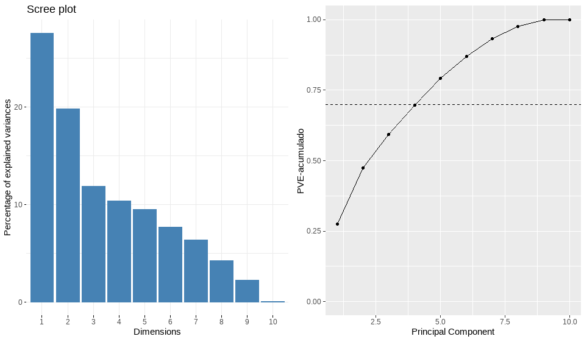
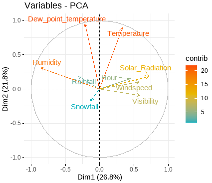
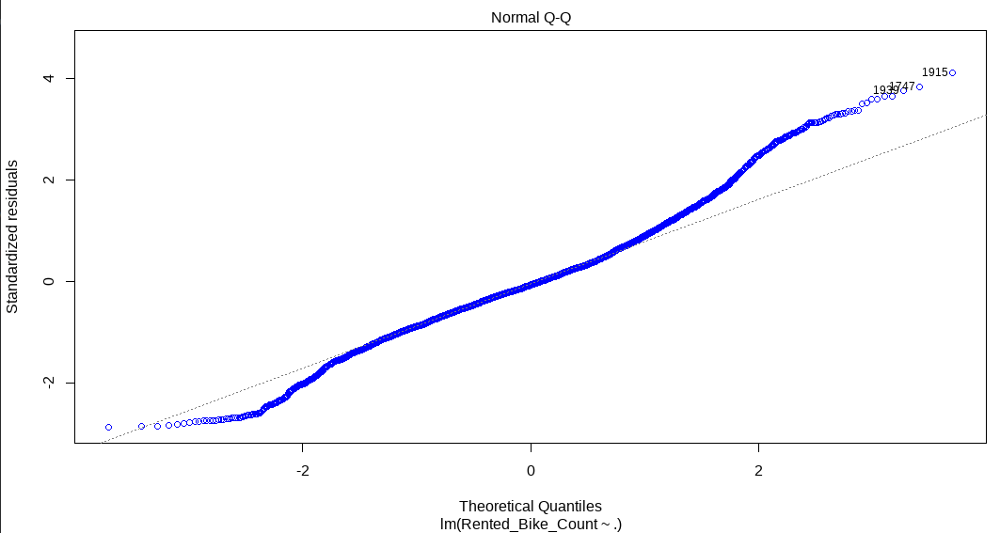
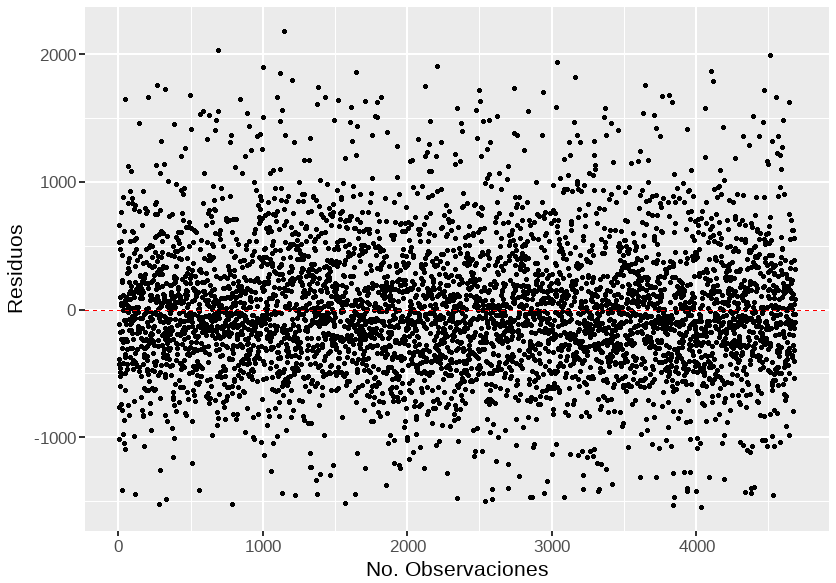
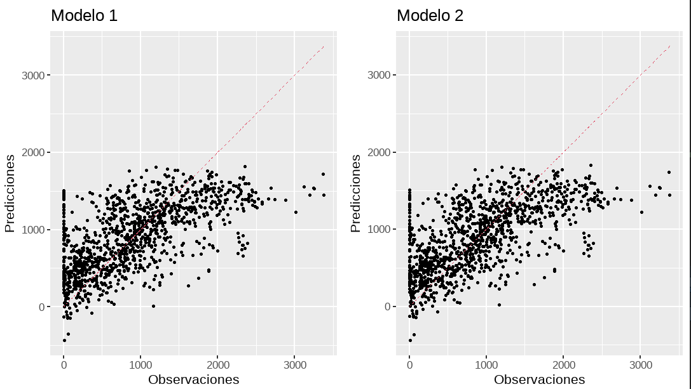

```{r,include=FALSE}
knitr::opts_chunk$set(echo = FALSE, message=FALSE, warning=FALSE, 
dev="cairo_pdf", fig.width=7, fig.height=3.5,fig.pos = 'H')
```

\newpage


\section{Introducción}

En el presente informe se presentan los resultados de un análisis de dos modelos de regresión lineal múltiple con el objetivo de reducir las variables no significativas y trabajar con una base de datos más pequeña.  


La reducción de dimensionalidad es la forma de convertir un conjunto de datos de dimensiones elevadas en un conjunto de datos de dimensiones menores, asegurando que la información que proporciona es similar en ambos casos. Esta técnica nos permite obtener un modelo predictivo más ajustado mientras se resuelven los problemas de regresión y clasificación que presentan los algoritmos.   


Por otro lado, la regresión logística resulta útil para los casos en los que se desea predecir la presencia o ausencia de una característica o resultado según los valores de un conjunto de predictores. Es similar a un modelo de regresión lineal pero está adaptado para modelos en los que la variable dependiente es dicotómica, es decir que puede tomar solo dos valores. Los coeficientes de regresión logística pueden utilizarse para estimar la razón de probabilidad de cada variable independiente del modelo. La regresión logística se puede aplicar a un rango más amplio de situaciones de investigación que el análisis discriminante.


```{r,echo=F}
library(tidyverse)
library(visdat)#tipos de variables
library(dlookr)#resumen medidas estadísticas
library(funModeling)
library(flextable) 
library(inspectdf) 
library(qqplotr) 
library(ggpmisc)
library(PerformanceAnalytics)
library(corrplot)
library(VIM) #datos faltantes
library(mice)
library(knitr)
library(MASS)
```

\newpage
\section{Desarrollo}
\subsection{Análisis de Componentes}

Para el análisis de componentes principales no tomamos en cuenta la variable cantidad de bicicletas rentadas ya que corresponde a la variable dependiente y  eliminando las variables categóricas dejando únicamente las variables numéricos, obteniendo un total de 10 variables, observando el gráfico de proporción de varianzas a la izquierda podemos ver que tiene porcentajes bastante disparejos presentando una diferencia de porcentajes de alrededor del 27% entre el primer y último componente, según el gráfico de varianza acumulada  con 4 componentes se puede lograr el 70% de la variabilidad total de los datos.


```{r fig1,echo=F,fig.align = "center",out.width = '100%',fig.cap="\\label{fig:fig1}Análisis de Componentes."}
#{r fig1, echo=FALSE, fig.cap="Título de la figura", out.width = '100%'}

```


En el gráfico de contribución de cada variable podemos observar que en las 2 primeras dimensiones tenemos un total del 47,5% de la variabilidad total de los datos, dentro de la dimensión 1 los componentes que contribuyen significativamente de forma positiva son radiación solar con gran contribución, mientras que en menor medida Hora, velocidad del viento, visibilidad y temperatura.
De forma negativa en la dimensión 1 serian humedad con gran contribución y en menor contribución serian lluvia y nevada.
En la dimensión 2 los componentes que contribuyen significativamente de forma positiva temperatura de punto de rocío y temperatura con gran contribución y en menor contribución, humedad y lluvia.
De forma negativa en la dimensión 2 serian nevada y visibilidad con poca contribución

```{r fig2,echo=F,fig.align = "center",out.width = '100%',fig.cap="\\label{fig:fig2}Análisis de Componentes."}
#{r fig1, echo=FALSE, fig.cap="Título de la figura", out.width = '100%'}

```

\newpage
\subsection{Regresión Lineal Múltiple.}
\subsection{Modelo 1.}
```{r tab1, echo=F,out.width = '100%'}
datos <- read.csv("rentBike_data.csv",sep = ",",header = TRUE)
datos2 = datos[,-c(1, 12, 13, 14)]
set.seed(100)
selectrows <- sample(1:nrow(datos2),round(0.80*nrow(datos2)))
dat.train <- datos2[selectrows,]
dat.test <- datos2[-selectrows,]

mod1<-lm(Rented_Bike_Count~.,data = dat.train)
coefic.lm<-summary(mod1)$coefficients
coefic.lm<-data.frame(Variables=row.names(coefic.lm),round(coefic.lm,4))
colnames(coefic.lm)<-c("Variables","Estimación","Std.Error","t.value","P-valor")
tab1 <- coefic.lm 
kable(tab1,caption = "\\label{tab:tab1}Modelo 1.",digits = 2)
```

Para el primer modelo podemos ver como las variables Visibility, Dew_point_temperature y Snowfall no son significativas ya que su p-valor es mayor a 0.05 o 5%.

```{r fig3,echo=F,fig.align = "center",out.width = '100%',fig.cap="\\label{fig:fig3} Q-Q plot Modelo 1."}
#{r fig1, echo=FALSE, fig.cap="Título de la figura", out.width = '100%'}

```

```{r fig4,echo=F,fig.align = "center",out.width = '100%',fig.cap="\\label{fig:fig4} Residuos Modelo 1."}
#{r fig1, echo=FALSE, fig.cap="Título de la figura", out.width = '100%'}

```


```{r,echo=F}
dat.train$resid<-mod1$residuals
shapiro.test(dat.train$resid)
```

Además no se cumplen los supuestos de normalidad.

\newpage
\subsection{Modelo 2.}

```{r tab2, echo=F,out.width = '100%'}
mod2.lm <- step(mod1, direction="backward",trace = 0) #trace=1 muestra los pasos que realiza.
coefic.lm2<-summary(mod2.lm)$coefficients
coefic.lm2<-data.frame(Variables=row.names(coefic.lm2),round(coefic.lm2,4))
colnames(coefic.lm2)<-c("Variables","Estimación","Std.Error","t.value","P-valor")
tab2 <- coefic.lm2
kable(tab2,caption = "\\label{tab:tab2}Modelo 2.",digits = 2)
```

Para este modelo 2 todas nuestras variables son significativas.

\newpage
\subsection{Comparación de Modelos.}
```{r tab3, echo=F,out.width = '100%'}
r2.mod1<-summary(mod1)$adj.r.squared*100
r2.mod2<-summary(mod2.lm)$adj.r.squared*100
dat.test$pred1<-predict(mod1,dat.test)
cor1<-cor(dat.test$Rented_Bike_Count,dat.test$pred1)
# error mod
error1 <- dat.test$pred1 - dat.test$Rented_Bike_Count
#bias
bias1<-mean(error1)
#RMSE
rmse1<-sqrt(mean(error1^2))
dat.test$pred2<-predict(mod2.lm,dat.test)
cor2<-cor(dat.test$Rented_Bike_Count,dat.test$pred2)

# error mod
error2 <- dat.test$pred2 - dat.test$Rented_Bike_Count
#bias
bias2<-mean(error2)
#RMSE
rmse2<-sqrt(mean(error2^2))
medidas.lm=data.frame(Medidas=c("R2.ajustado","COR","BIAS","RMSE"),
                      Modelo_1=c(r2.mod1,cor1,bias1,rmse1),
                      Modelo_2=c(r2.mod2,cor2,bias2,rmse2))
tab3 <- medidas.lm
kable(tab3,caption = "\\label{tab:tab3}Medidas de Comparación de los Modelos.",digits = 2)
```

R cuadrado ajustado nos indica el porcentaje de variabilidad total de la variable de respuesta, en este caso no hay una gran diferencia pero el modelo 2 explica en un 41,14% el índice de bicicletas rentadas, es decir un 0.02% más que el modelo 1. Por otro lado la medida cor nos indica la correlación entre lo predicho y lo observado, es decir entre más cercano a 1 sea es mejor, por lo que igual que en el punto anterior el dos es mejor.

El promedio del error (BIAS), nos indica la relación entre el error esperado y el obtenido, aquí al obtener valor negativo nos indica que obtuvimos un valor mayor al esperado. Y  el error cuadrático medio RMSE indica que entre menor sea su valor es mejor nuestro modelo, y en este caso nuevamente el segundo modelo es mejor que el primero.


```{r fig5,echo=F,fig.align = "center",out.width = '100%',fig.cap="\\label{fig:fig5} Comparación de los Modelos."}
#{r fig1, echo=FALSE, fig.cap="Título de la figura", out.width = '100%'}

```


\newpage
\section{Conclusiones}

Luego de este análisis podemos concluir que los modelos son similares y no son viables. Esto se debe a que la variable dependiente con la que trabajamos (Bicicletas rentadas) tiene una distribucion asimetrica positiva, por la regresion lineal multiple no arroja un buen modelo, para obtener un modelo viable tendríamos que convertir la variable para que tenga una distribución normal y luego realizar nuevamente la regresión. 

