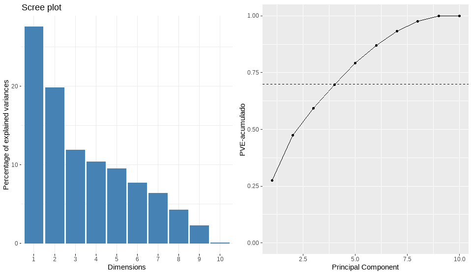
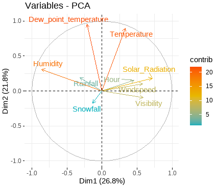
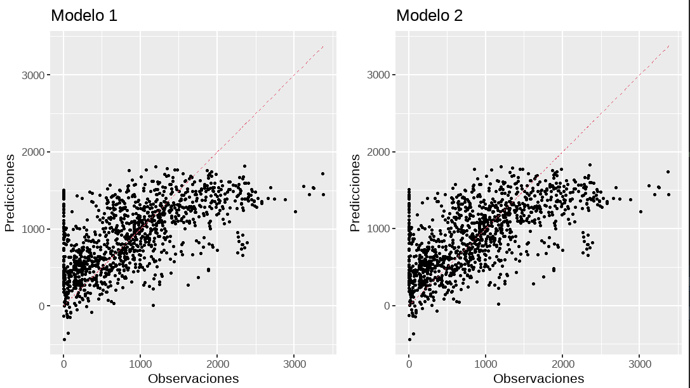

```{r setup, include=FALSE}
knitr::opts_chunk$set(echo = TRUE)
```

## Introducción

- Regresión Lineal Múltiple.

{width="300px"}


## Variable Dependiente y Variables Independientes

### Variable Dependiente: 
- "Rented_Bike_Count"

### Variables Independientes:


::: columns

:::: column
\begingroup

\fontfamily{phv}\fontsize{9}{16}\selectfont

- Temperature
- Humidity
- Windspeed
- Visibility
- Dew_point_temperature


\endgroup
::::

:::: column
\begingroup

\fontfamily{phv}\fontsize{9}{16}\selectfont
- Solar_Radiation
- Rainfall
- Snowfall
- Seasons
- Holiday

\endgroup
::::

:::

### Variables Categóricas eliminadas:
 - Date, Seasons, Holiday, Functioning_Day


## Análisis Componentes Principales

{width="400px"}

## Análisis Componentes Principales

{width="300px"}

## Primer Modelo y Tabla Resumen

{width="300px"}


## Primer Modelo y Tabla Resumen

### Shapiro-Wilk normality test  
- W = 0.97948, p-value < 2.2e-16  

{width="350px"}


## Segundo Modelo y Tabla Resumen

{width="300px"}

## Evaluación de Desempeño


{width="200px"}


## Evaluación de Desempeño

{width="400px"}

## Conclusiones

### Concluyendo la presentación llegamos a los siguientes puntos importantes.
- No existe Normalidad en ninguno de los modelos.
- En el Modelo 2 logramos que todas las variables sean significativas.
- La Variabilidad de nuestro mejor modelo es entre regular y baja.
- Modelo 2 es mejor que el primer modelo por unas pocas décimas.
