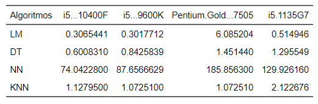
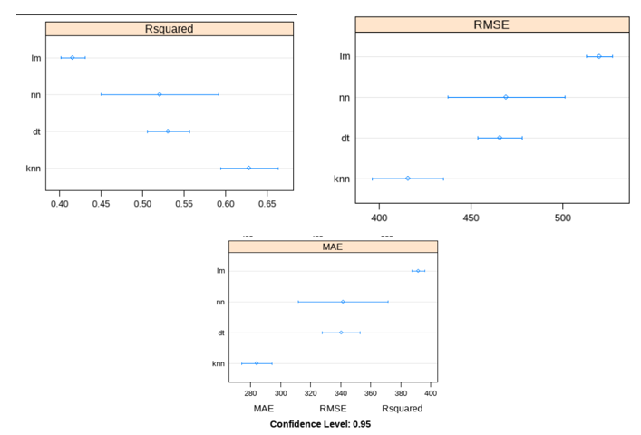
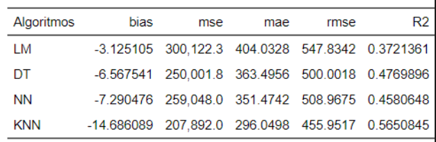
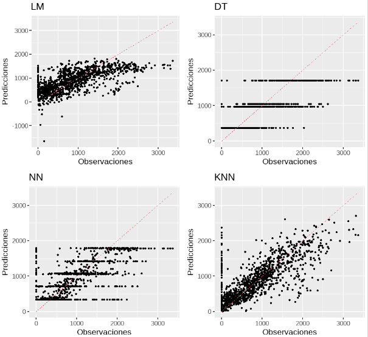
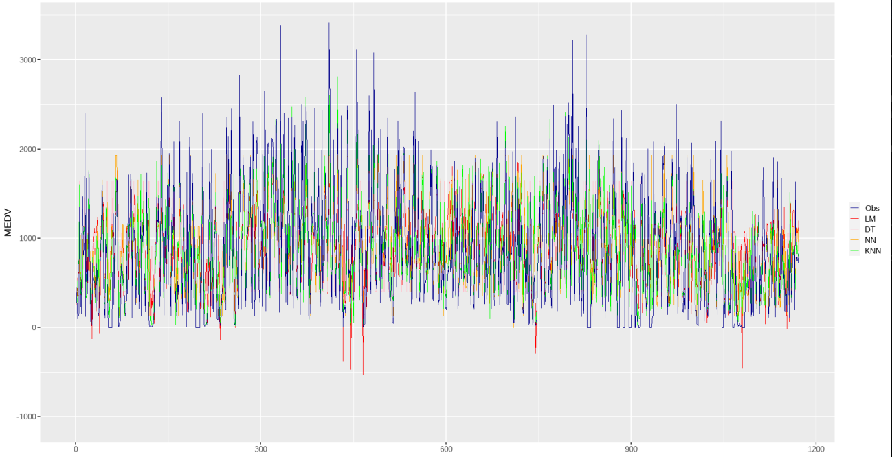

```{r setup, include=FALSE}
knitr::opts_chunk$set(echo = TRUE)
library(ggplot2)
library(class)
library(caret)
library(e1071)
library(FNN)
library(MASS)
library(tidyverse)
library(visdat)#tipos de variables
library(dlookr)#resumen medidas estadísticas
library(funModeling)
library(flextable) 
library(inspectdf) 
library(qqplotr) 
library(ggpmisc)
library(PerformanceAnalytics)
library(corrplot)
library(VIM) #datos faltantes
library(mice)
library(knitr)
library(MASS)
                      
library(flextable)
```

## Introducción

Técnicas para Clasificación Supervisadas

- Regresión Lineal Múltiple  
- Redes Neuronales  
- Árbol de Decisión  
- K-Vecinos mas cercanos  


Objetivos  

- Comparar los distintos algoritmos
- Predecir Varible Independiente: Rented_Bike_Count


## Comparación Procesadores distintos algoritmos
```{r fig1,echo=F,fig.align = "center",out.width = '100%',fig.cap="\\label{fig:fig1}Comparación Procesadores."}
#{r fig1, echo=FALSE, fig.cap="Título de la figura", out.width = '100%'}

```
## Médidas de Diágnostico
```{r fig2,echo=F,fig.align = "center",out.width = '100%',fig.cap="\\label{fig:fig2}Medidas de Diágnostico."}
#{r fig1, echo=FALSE, fig.cap="Título de la figura", out.width = '100%'}

```
## Métricas
```{r fig3,echo=F,fig.align = "center",out.width = '100%',fig.cap="\\label{fig:fig3}Tabla de Errores."}
#{r fig1, echo=FALSE, fig.cap="Título de la figura", out.width = '100%'}

```
## Predicciones
```{r fig4,echo=F,fig.align = "center",out.width = '80%',fig.cap="\\label{fig:fig4}Predicciones."}
#{r fig1, echo=FALSE, fig.cap="Título de la figura", out.width = '100%'}

```
## MEDV
```{r fig5,echo=F,fig.align = "center",out.width = '100%',fig.cap="\\label{fig:fig5}MEDV."}
#{r fig1, echo=FALSE, fig.cap="Título de la figura", out.width = '100%'}

```
## Conclusiones

- En el medv KNN es el que más se asemeja a las observaciones debido a que esta es la que más se acerca a los picos de estas mismas 
- KNN tiene mejor valor para R cuadrado representando su error en el modelo y LM tiene el peor coeficiente de determinación (R cuadrado)

- KNN es el que presenta el peor BIAS mientras que LM (lineal multiple) presenta el mejor BIAS significando que tiene el mejor promedio de error 
- Tiempo de procesamiento: LM es el más rápido mientras que el más lento es NN (redes neuronales)


